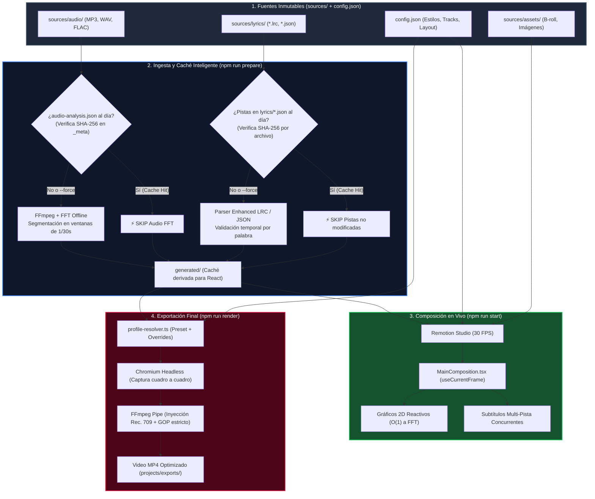
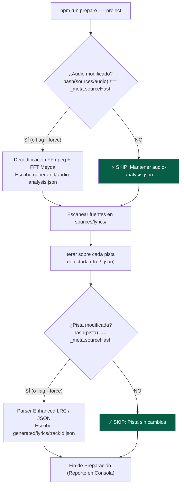
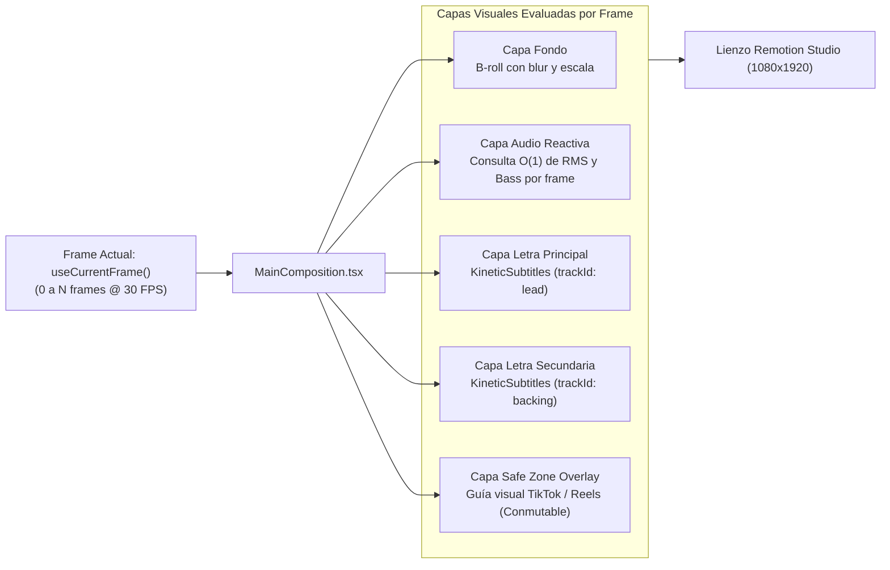
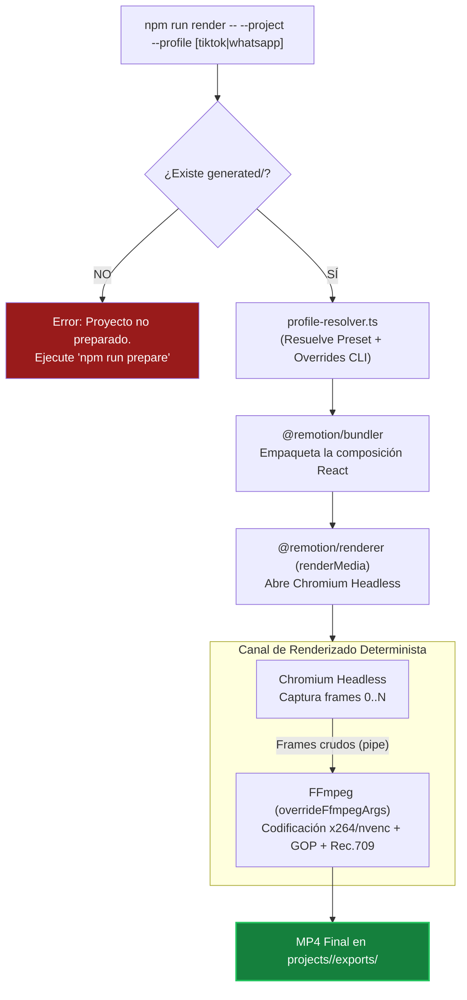

# WebMov: Pipeline de Ejecución y Ciclo de Vida Operativo

Este documento describe a **alto nivel** el ciclo de vida de ejecución, el flujo de datos y las reglas operativas de caché de **WebMov**. 

> [!NOTE]
> **Principio de Fuente Única de Verdad (SSOT):**
> Este documento se enfoca exclusivamente en la **orquestación visual del flujo**. Las especificaciones técnicas de bajo nivel (esquemas JSON de `_meta`, tipos TypeScript, perfiles de compresión y parámetros FFmpeg) residen únicamente en [**ARCHITECTURE.md**](./ARCHITECTURE.md).

---

## 1. Diagrama de Flujo Global de Extremo a Extremo

---

## 2. Etapa 1: Ingesta Incremental Granular (`npm run prepare`)

El comando `prepare` actúa como un filtro inteligente: transforma insumos humanos en datos estructurados de alta velocidad, evitando cálculos redundantes mediante verificación de hashes criptográficos.

### Reglas de Caché y Omisión:
* **Caché Hit Total:** Si nada cambió en `sources/`, el script concluye en milisegundos sin consumir CPU.
* **Caché Hit Parcial:** Si solo se ajusta un archivo de letras secundario (ej. `backing.lrc`), se omite la decodificación de audio y las demás pistas, procesando exclusivamente el archivo modificado.
* **Sobreescritura forzada:** La bandera `--force` invalida todos los hashes y fuerza la recomputación completa.

---

## 3. Etapa 2: Composición Cuadro a Cuadro en React (`npm run start`)

Remotion desacopla la reproducción temporal de los milisegundos del sistema, gobernando la composición estrictamente a través de fotogramas (`useCurrentFrame()`).

* Cada pista de subtítulos es una instancia autónoma de `<KineticSubtitles />` con su propia coordenada $Y$, escala y paleta de color configuradas en `config.json`.
* Ninguna capa de React accede a `sources/`; leen exclusivamente los datos ya normalizados en `generated/`.

---

## 4. Etapa 3: Exportación Headless y Multiplexado (`npm run render`)

---

## 5. Matriz de Estados de Ejecución

| Escenario del Desarrollador | ¿Requiere `prepare`? | ¿Qué ejecuta internamente? | Comando sugerido |
| :--- | :--- | :--- | :--- |
| **Proyecto nuevo o recién clonado** | **Obligatorio** | Decodificación audio FFT + Parsing de todas las pistas de letras | `npm run prepare -- --project <nombre>` |
| **Continuar diseño visual existente** | **No** (Se salta por completo) | Abre directamente Remotion Studio consumiendo la caché existente | `npm run start` |
| **Edición de un archivo de letra (`.lrc`)** | **Recomendado** | Omite audio FFT; procesa únicamente la pista modificada (<100ms) | `npm run prepare -- --project <nombre>` |
| **Cambio de archivo de audio (`.mp3`/`.wav`)**| **Recomendado** | Recalcula audio FFT; omite parsing de letras | `npm run prepare -- --project <nombre>` |
| **Exportación final directa** | **No** (si `generated/` está al día)| Empaqueta headless, renderiza cuadros e inyecta perfiles FFmpeg | `npm run render -- --project <nombre> --profile tiktok` |
| **Forzar recomputación absoluta** | Manual | Invalida todas las cachés y recalcula todo desde cero | `npm run prepare -- --project <nombre> --force` |

---

## 6. Referencias Complementarias

* Para la especificación de tipos, metadatos `_meta` y tablas de perfiles de codificación, consulta [**ARCHITECTURE.md**](./ARCHITECTURE.md).
* Para el seguimiento de fases de implementación y criterios de aceptación, consulta [**ROADMAP.md**](./ROADMAP.md).
