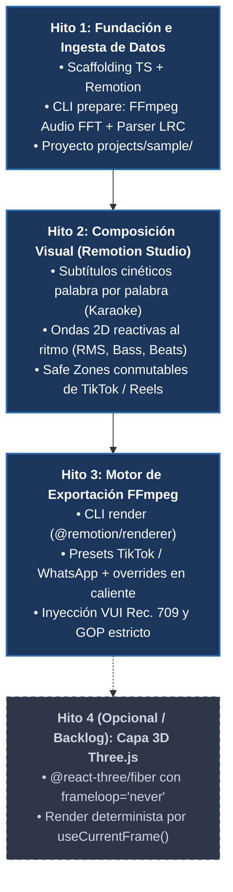

# WebMov: Hoja de Ruta y Plan de Implementación (ROADMAP)

Documento de planificación secuencial para el desarrollo de **WebMov**. Define los hitos técnicos ordenados por su cadena estricta de dependencias, junto con sus tareas específicas y criterios de aceptación verificables.

---

## 🗺️ Estrategia de Ejecución: Pipeline Vertical Secuencial

Para evitar el uso de datos simulados (*mocks*) y asegurar que cada componente se construya sobre cimientos reales y funcionales, el desarrollo sigue una **estrategia secuencial estricta**:

---

## 📌 Hito 1: Fundación del Entorno y Pipeline de Ingesta (`npm run prepare`)

> **Objetivo:** Establecer el repositorio base, configurar las herramientas de desarrollo y construir el motor de procesamiento offline para que cualquier audio y archivo de letras se convierta en datos limpios consumibles por React.

### 1.1 Tareas a Realizar

- [ ] **Scaffolding del Proyecto:**
  - Inicializar `package.json` con dependencias base: `remotion`, `@remotion/cli`, `@remotion/renderer`, `react`, `react-dom`, `typescript`, `zod`, `meyda`.
  - Configurar `tsconfig.json` optimizado para Remotion y Node.js en Windows.
  - Configurar scripts en `package.json`: `prepare`, `start`, `render`.
- [ ] **Estructura de Carpetas:**
  - Crear directorios `src/`, `scripts/`, `projects/sample/`.
- [ ] **Creación del Proyecto Modelo (`projects/sample/`):**
  - Insumos de prueba: `sources/audio/sample.mp3`, `sources/lyrics/` con soporte multi-pista (ej. `lead.lrc` con marcas palabra por palabra `<mm:ss.xx>` y opcionalmente `backing.lrc`), `sources/assets/`.
  - Manifiesto `config.json` inicial (dimensiones 1080x1920, 30 FPS, paleta de colores, mapeo de pistas `subtitles.tracks`).
- [ ] **Módulo Analizador de Audio (`scripts/prepare/audio-analyzer.ts`):**
  - Decodificación automática mediante FFmpeg a buffer WAV PCM temporal (44.1 kHz, 16-bit).
  - Cálculo de FFT, RMS y detección de picos/beats a intervalos exactos de $\frac{1}{30}$ s.
  - Generación de `projects/<nombre>/generated/audio-analysis.json` con metadatos `_meta`.
- [ ] **Módulo Parser de Letras Multi-Pista (`scripts/prepare/lrc-parser.ts`):**
  - Detección automática de todas las pistas (`.lrc` o `.json`) presentes en `sources/lyrics/`.
  - Parser de Enhanced LRC a esquema estandarizado (cálculo de `startMs` y `endMs` por palabra).
  - Soporte de ingesta directa de archivos `.json` colocados en `sources/lyrics/`.
  - Validación matemática de tiempos (sin solapamientos negativos) independiente por pista.
  - Generación modular de archivos individuales en `projects/<nombre>/generated/lyrics/<trackId>.json` con metadatos `_meta` (`schemaVersion` del parser de WebMov).
- [ ] **CLI Unificado de Preparación (`scripts/prepare-project.ts`):**
  - Orquestador invocado mediante `npm run prepare -- --project <nombre>`.

### 1.2 Criterio de Aceptación

- Ejecutar `npm run prepare -- --project sample` lee los insumos de `sources/` y genera exitosamente `generated/audio-analysis.json` y los archivos independientes `generated/lyrics/<trackId>.json`.
- Cada archivo de letra incluye su encabezado `_meta` con la versión técnica del esquema (`schemaVersion`) y el hash de su archivo fuente.
- Ante un archivo LRC malformado o falta de audio, el script emite un error descriptivo en consola indicando el archivo y la línea exacta.

---

## 📌 Hito 2: Motor de Composición Visual en Remotion Studio (`npm run start`)

> **Objetivo:** Construir los componentes de video en React y permitir la previsualización interactiva con audio sincronizado, karaoke dinámico multi-pista y guías de interfaz de redes sociales en Remotion Studio (puerto local base `30900`, rango reservado `30900` a `30999`).

### 2.1 Tareas a Realizar

- [ ] **Configuración Raíz de Remotion (`src/Root.tsx` e `index.ts`):**
  - Registro de `<Composition />` con formato vertical nativo: $1080 \times 1920$ px a 30 FPS.
  - Cargador dinámico que enlaza las `props` del proyecto seleccionado (`config.json`, pistas en `generated/lyrics/*.json`, `audio-analysis.json`).
- [ ] **Componente de Tipografía Cinética Reutilizable (`KineticSubtitles.tsx`):**
  - Componente desacoplado capaz de renderizar cualquier pista de letras de forma independiente según sus props (`lines`, `position`, `fontSize`, colores).
  - Sincronización palabra por palabra con `useCurrentFrame()` y `fps`.
  - Estados visuales dinámicos: *palabra activa* (resaltado de color, escala aumentada, glow), *palabras ya cantadas* (opacidad normal) y *palabras futuras* (baja opacidad).
  - Renderizado concurrente de múltiples pistas en pantalla (ej. voz principal y coros con sus propios tiempos y posiciones sin colisiones).
- [ ] **Componentes Reactivos al Ritmo 2D (`AudioWaveform2D.tsx` y `AudioPulse.tsx`):**
  - Barras espectrales y ondas sonoras generadas mediante Canvas/SVG reactivas a `bass`, `mid`, `treble` y `rms`.
  - Efectos de pulso y resplandor al compás cuando `isBeat === true`.
- [ ] **Capa Conmutable de Zonas Seguras (`SafeZoneOverlay.tsx`):**
  - Overlay translúcido que delimita los elementos de la interfaz de TikTok e Instagram Reels (botones de interacción a la derecha, descripción y barra de audio inferior).
  - Toggle de activación en el panel de propiedades de Remotion Studio (desactivado por defecto en la exportación final).
- [ ] **Capa de Medios de Fondo:**
  - Soporte para imagen estática con zoom sutil o video de fondo B-roll con `<OffthreadVideo />`, con filtros de desenfoque y viñeteado.

### 2.2 Criterio de Aceptación

- Ejecutar `npm run start` abre Remotion Studio en el navegador en el puerto asignado (base `30900` dentro del rango libre `30900` a `30999`).
- El timeline permite hacer *scrub* cuadro a cuadro y verificar que las palabras de cada pista de subtítulos se iluminan en el frame exacto de su marca de tiempo independiente.
- Se pueden visualizar 2 o más pistas de letras en pantalla simultáneamente en distintas coordenadas espaciales sin superposición indeseada.
- Las ondas 2D y pulsos visuales reaccionan audiblemente sincronizados con el audio de `sample.mp3`.
- El overlay de Safe Zones de TikTok/Reels se puede encender y apagar desde la interfaz visual sin errores.

---

## 📌 Hito 3: Motor de Exportación y Perfiles Extensibles (`npm run render`)

> **Objetivo:** Orquestar el renderizado final desatendido a video MP4 utilizando `@remotion/renderer` y Chromium Headless, inyectando perfiles de compresión FFmpeg optimizados para no sufrir degradación en redes.

### 3.1 Tareas a Realizar

- [ ] **Sistema de Resolución de Perfiles (`scripts/render/profile-resolver.ts`):**
  - Presets preconfigurados de referencia: `tiktok` (10 Mbps, GOP 60, VUI Rec. 709) y `whatsapp` (2.8 Mbps, GOP 30, &lt;16 MB).
  - Carga de perfiles personalizados declarados en `config.json` o en `encoding-profiles.json`.
  - Fusión en caliente con banderas de CLI (`--bitrate`, `--crf`, `--gop`, `--preset`, `--gpu`).
- [ ] **Constructor de Argumentos FFmpeg (`buildFfmpegArgs`):**
  - Generación de la lista de argumentos para `overrideFfmpegArgs` de `@remotion/renderer`.
  - Inyección estricta de metadatos VUI (`-color_primaries bt709 -color_trc bt709 -colorspace bt709 -color_range tv`).
  - Soporte de aceleración por GPU NVIDIA (`h264_nvenc`) con fallback automático a CPU (`libx264`).
- [ ] **Script CLI de Renderizado (`scripts/render-video.ts`):**
  - Invocación mediante `npm run render -- --project <nombre> [opciones]`.
  - Empaquetado automático con `@remotion/bundler` y renderizado de frames con Chromium Headless.
  - Barra de progreso en la consola con porcentaje y estimación de tiempo.
  - Guardado del archivo final en `projects/<nombre>/exports/<nombre>_<perfil>_<timestamp>.mp4`.

### 3.2 Criterio de Aceptación

- Ejecutar `npm run render -- --project sample --profile tiktok` genera un archivo `.mp4` en `projects/sample/exports/`.
- El video resultante cumple con: resolución exacta 1080x1920, 30 FPS, GOP cerrado de 60 cuadros y metadatos Rec. 709 verificables mediante `ffprobe`.
- Ejecutar `npm run render -- --project sample --profile tiktok --bitrate 16M` aplica la sobreescritura de tasa de bits al vuelo sin modificar el código fuente.

---

## 📋 Resumen del Estado de los Hitos

| Hito       | Alcance Principal                             | Estado                | Dependencia Previa |
| :---------- | :--------------------------------------------- | :--------------------- | :------------------ |
| **Hito 1** | Fundación TS/Remotion + Ingesta CLI `prepare` | ⏳ **Siguiente Paso**  | Ninguna            |
| **Hito 2** | Composición Visual 2D + Remotion Studio       | ⏸️ Pendiente          | Hito 1             |
| **Hito 3** | Motor de Render FFmpeg + CLI `render`         | ⏸️ Pendiente          | Hito 2             |
| **Hito 4** | Capa 3D Three.js Determinista                 | 💤 Opcional / Backlog | Hito 3             |

