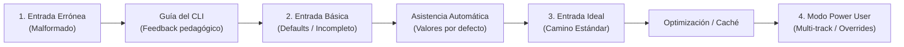

# WebMov: Especificación Exhaustiva de Testing y Calidad (TESTING_SPECIFICATION)

Este documento define la **especificación completa, rigurosa y multidimensional de pruebas** para el ecosistema **WebMov**. 

La estrategia de pruebas no se limita a verificar el "camino feliz" (*happy path*), sino que modela el **espectro completo del comportamiento del usuario**: desde errores comunes, archivos corruptos o incompletos con respuestas pedagógicas guiadas, hasta configuraciones avanzadas de producción con determinismo cuadro a cuadro.

---

## 🎯 1. Filosofía de Calidad: Testing Orientado a la Experiencia del Usuario (UX-Driven Testing)

Un software programático y basado en CLI debe actuar como un tutor para el desarrollador. Cada prueba debe validar dos dimensiones:
1. **Precisión Técnica y Determinismo Matemático:** Que los cálculos de audio, parsing de subtítulos y renderizado cuadro a cuadro sean exactos e invariantes.
2. **Pedagogía Activa y Resiliencia:** Que cuando el usuario cometa un error o ingrese datos incompletos, el sistema **nunca lance un stack trace crudo ni falle silenciosamente**, sino que emita un diagnóstico claro indicando:
   * **Qué falló** (archivo, línea, propiedad o parámetro).
   * **Por qué falló** (descripción en lenguaje accesible).
   * **Cómo corregirlo** (ejemplo exacto de la sintaxis esperada o acción sugerida).

```
┌──────────────────────────────────────────────────────────────────────────────┐
│                    EL ESPECTRO DE EXPERIENCIA DEL USUARIO                    │
├───────────────────┬───────────────────┬───────────────────┬──────────────────┤
│ 1. Mal Formado    │ 2. Incompleto     │ 3. Por Defecto    │ 4. Modo Experto  │
│ (Error pedagógico)│ (Degradación suave│ (Camino base sin  │ (Multi-pista,    │
│                   │  o auto-defaults) │  configuración)   │  overrides CLI)  │
└───────────────────┴───────────────────┴───────────────────┴──────────────────┘
```

---

## 🏗️ 2. Arquitectura del Entorno de Pruebas

### 2.1 Herramientas y Ecosistema
* **Test Runner:** `vitest` (ejecución ultrarrápida en Node.js/Windows con soporte nativo de TypeScript y ESM).
* **DOM / React Testing:** `@testing-library/react` para validar el montaje y propiedades de componentes sin levantar el navegador completo.
* **Remotion Testing:** `@remotion/renderer` para renderizado headless determinista de cuadros aislados en memoria (`renderStill`).
* **Inspección de Video:** `ffprobe` vía `@ffprobe-installer/ffprobe` o binario del sistema para verificar metadatos de compresión, GOP, VUI BT.709 y pistas de audio.
* **Audio Sintético:** Generador procedural de archivos WAV PCM en memoria (ondas sinusoidales puras a frecuencias conocidas para validar FFT de graves, medios y agudos sin depender de archivos pesados con copyright).

### 2.2 Estructura del Banco de Pruebas (`tests/`)

```text
webmov/
  ├── tests/
  │   ├── fixtures/                      # Insumos controlados para pruebas
  │   │   ├── audio/
  │   │   │   ├── valid_44100_stereo.wav # Audio limpio estándar
  │   │   │   ├── valid_48000.flac       # Audio FLAC alta calidad
  │   │   │   ├── sine_100hz_bass.wav    # Generado: Frecuencia pura en subgraves (100 Hz)
  │   │   │   ├── sine_1000hz_mid.wav    # Generado: Frecuencia pura en medios (1 kHz)
  │   │   │   ├── silence_1s.mp3         # Audio en silencio absoluto (RMS = 0)
  │   │   │   ├── corrupt_audio.mp3      # Archivo con cabeceras corruptas
  │   │   │   └── zero_byte.wav          # Archivo vacío (0 bytes)
  │   │   ├── lyrics/
  │   │   │   ├── valid_enhanced.lrc     # LRC con marcas palabra por palabra válidas
  │   │   │   ├── valid_backing.lrc      # Segunda pista para pruebas multi-pista
  │   │   │   ├── valid_standard.lrc     # LRC tradicional (solo marcas de línea)
  │   │   │   ├── valid_external.json    # JSON externo estilo Whisper/STT
  │   │   │   ├── malformed_syntax.lrc   # Tags rotos, corchetes sin cerrar
  │   │   │   ├── inverted_timing.lrc    # Palabras con startMs > endMs
  │   │   │   ├── empty_lines.lrc        # Solo espacios y saltos de línea
  │   │   │   └── invalid_json.json      # JSON con error de sintaxis
  │   │   └── configs/
  │   │       ├── default_valid.json     # Configuración estándar 1080x1920 @ 30fps
  │   │       ├── minimal_empty.json     # Objeto `{}` (prueba de valores por defecto)
  │   │       ├── invalid_types.json     # fps como string, dimensiones negativas
  │   │       └── advanced_multitrack.json # Múltiples capas y posiciones Y
  │   ├── unit/                          # Pruebas unitarias de algoritmos puros
  │   │   ├── lrc-parser.test.ts         # Parser de Enhanced LRC y validación de marcas
  │   │   ├── audio-analyzer.test.ts     # FFT, bandas espectrales, RMS y beats
  │   │   ├── profile-resolver.test.ts   # Presets, herencia y overrides de FFmpeg
  │   │   └── config-validator.test.ts   # Esquemas Zod y defaults de config.json
  │   ├── integration/                   # Pruebas de integración de comandos CLI
  │   │   ├── prepare-cli.test.ts        # Flujo completo de 'npm run prepare' y caché
  │   │   └── render-cli.test.ts         # Flujo de empaquetado y argumentos FFmpeg
  │   ├── components/                    # Pruebas de componentes React / Remotion
  │   │   ├── KineticSubtitles.test.tsx  # Estados de palabras (pasadas, activas, futuras)
  │   │   ├── AudioWaveform2D.test.tsx   # Reactividad ante datos FFT
  │   │   └── SafeZoneOverlay.test.tsx   # Visibilidad y geometría de guías sociales
  │   └── e2e/                           # Pruebas End-to-End completas
  │       └── full-pipeline.test.ts      # Proyecto temporal -> Prepare -> Render MP4 -> ffprobe
```

---

## 📋 3. Matriz Exhaustiva de Funcionalidades y Casos de Prueba

---

### MÓDULO A: Ingesta y Análisis de Audio (`audio-analyzer.ts`)

Objetivo: Decodificar audio universal (MP3, WAV, FLAC), calcular ventanas FFT de $\frac{1}{30}\text{s}$, segmentar bandas espectrales y generar `audio-analysis.json`.

| ID | Escenario | Variación | Entrada | Comportamiento Esperado y Validación |
| :--- | :--- | :--- | :--- | :--- |
| **AUD-01** | **Mal Formado** | Archivo Corrupto | `corrupt_audio.mp3` | **Fallo controlado**. El CLI atrapa el error de FFmpeg y reporta: `"El archivo de audio 'sources/audio/track.mp3' está dañado o no es un contenedor válido. Verifique el archivo."` Exit code `1`. |
| **AUD-02** | **Mal Formado** | Archivo 0 Bytes | `zero_byte.wav` | **Fallo controlado**. Emite error informativo: `"El archivo de audio está vacío (0 bytes)."`. |
| **AUD-03** | **Mal Formado** | Extensión inválida o archivo renombrado falso | `fake_audio.mp3` (archivo de texto plano renombrado) | **Fallo controlado**. Diagnostica que los encabezados del stream no corresponden a un códec de audio reconocible. |
| **AUD-04** | **Incompleto** | Carpeta de audio vacía | Directorio `sources/audio/` sin archivos | **Guía al usuario**. Mensaje instructivo: `"No se encontró ningún archivo de audio en 'sources/audio/'. Agregue una pista en formato .mp3, .wav o .flac para continuar."` |
| **AUD-05** | **Incompleto** | Múltiples audios ambiguos | `track1.mp3` y `track2.wav` simultáneos | **Guía al usuario**. Reporta colisión: `"Se detectaron múltiples archivos de audio. Especifique el archivo principal o mantenga solo uno en 'sources/audio/'."` |
| **AUD-06** | **Incompleto** | Audio ultracorto (< 1 cuadro) | Audio de 15 milisegundos (< 33.3 ms) | **Degradación segura**. Genera al menos 1 frame en `audio-analysis.json` sin producir índices negativos ni división por cero. |
| **AUD-07** | **Incompleto** | Audio en Silencio Absoluto | `silence_1s.mp3` | Genera frames válidos donde `rms === 0`, `bass === 0`, `mid === 0`, `treble === 0`, `isBeat === false`. No arroja `NaN` ni `-Infinity`. |
| **AUD-08** | **Por Defecto** | Audio MP3 estándar 44.1 kHz Estéreo | `valid_44100_stereo.wav` | Procesa el audio completo. Genera exactamente $\lceil \text{duración en s} \times 30 \rceil$ frames. `_meta` incluye `sourceHash` SHA-256 exacto. |
| **AUD-09** | **Modo Experto** | Audio FLAC de alta fidelidad 96 kHz | `highres.flac` | Realiza remuestreo automático a 44.1 kHz PCM sin degradar la precisión temporal de los frames. |
| **AUD-10** | **Modo Experto** | Verificación de Bandas Frecuenciales Puras | `sine_100hz_bass.wav` (tono puro 100 Hz) | Verifica matemáticamente que la banda `bass` ($20-250\text{ Hz}$) tiene valor cercano a $1.0$, mientras que `mid` y `treble` se mantienen en $0.0$. |
| **AUD-11** | **Modo Experto** | Detección de Transitorios / Beats | Tono con pulsos intermitentes de alta energía | Verifica que `isBeat` se active (`true`) en los frames correspondientes al flanco de subida de la energía y vuelva a `false` en el decaimiento. |

---

### MÓDULO B: Parser de Letras Multi-Pista (`lrc-parser.ts`)

Objetivo: Parsear archivos `.lrc` (estándar y Enhanced) o `.json` externos, validar consistencia temporal palabra por palabra y normalizar a `generated/lyrics/<trackId>.json`.

| ID | Escenario | Variación | Entrada | Comportamiento Esperado y Validación |
| :--- | :--- | :--- | :--- | :--- |
| **LRC-01** | **Mal Formado** | Sintaxis de tiempo rota | `[99:99] texto` o `[xx:yy.zz]` | **Error Pedagógico**. Indica archivo, línea y columna: `"Error de sintaxis en 'sources/lyrics/lead.lrc', Línea 3: Marca de tiempo '[99:99]' inválida. Formato esperado: [mm:ss.xx] (ej: [01:23.45])."` |
| **LRC-02** | **Mal Formado** | Inversión temporal por palabra | `<00:10.00> hola <00:05.00> mundo` | **Error Pedagógico**. Detecta que `startMs` (10000) > `endMs` (5000): `"Error temporal en 'lead.lrc', Línea 5: La palabra 'hola' finaliza antes de comenzar (10.0s > 5.0s)."` |
| **LRC-03** | **Mal Formado** | JSON externo corrupto | `sources/lyrics/whisper.json` con coma extra | **Error Pedagógico**. Diagnostica error de sintaxis JSON e indica la línea del archivo de origen. |
| **LRC-04** | **Incompleto** | LRC Tradicional sin marcas por palabra | `[00:02.00] Frase completa cantada` | **Degradación Inteligente / Auto-reparto**. El parser interpola de forma proporcional la duración de cada palabra a lo largo del intervalo de la línea, permitiendo que el componente de karaoke funcione sin fallar. |
| **LRC-05** | **Incompleto** | Letra sin archivo en `sources/lyrics/` | Carpeta `sources/lyrics/` vacía | **Modo Instrumental / Degradación Suave**. Emite aviso: `"No se encontraron letras. El video se generará sin capa de subtítulos."` No aborta el pipeline. |
| **LRC-06** | **Incompleto** | Líneas vacías y espacios aleatorios | Múltiples líneas con solo `\r\n` o espacios | El parser descarta líneas vacías sin crear nodos fantasma ni desfasar los identificadores `id`. |
| **LRC-07** | **Por Defecto** | Pista única con nombre estándar | `track.lrc` | Se normaliza automáticamente con `trackId: "main"`, generando `generated/lyrics/main.json`. `schemaVersion` es estrictamente `"1.0.0"`. |
| **LRC-08** | **Modo Experto** | Multi-Pista Concurrente con Solapamiento | `lead.lrc` + `backing.lrc` simultáneos | Genera `lead.json` y `backing.json` independientes. Valida que ambas pistas puedan tener intervalos coincidentes en el tiempo sin colisionar identificadores de línea. |
| **LRC-09** | **Modo Experto** | Caracteres Especiales y Multilingüe | Emojis, caracteres japoneses/cirílicos, apóstrofes | Conserva la codificación UTF-8 intacta en `generated/lyrics/*.json` sin caracteres escapados corruptos (`\ufffd`). |

---

### MÓDULO C: Orquestador CLI y Motor de Caché (`prepare-project.ts`)

Objetivo: Administrar la idempotencia y la velocidad incremental de `npm run prepare -- --project <nombre>`.

| ID | Escenario | Variación | Entrada | Comportamiento Esperado y Validación |
| :--- | :--- | :--- | :--- | :--- |
| **PRE-01** | **Mal Formado** | Proyecto Inexistente | `npm run prepare -- --project fantasma` | **Error Instructivo**. `"El proyecto 'projects/fantasma' no existe. Proyectos disponibles: [sample, promo-01]. Cree el directorio o verifique el nombre."` |
| **PRE-02** | **Incompleto** | Sin argumento `--project` | `npm run prepare` (sin flags) | **Guía de uso en consola**. Muestra ayuda de sintaxis: `"Uso: npm run prepare -- --project <nombre_proyecto> [--force]"` con ejemplos interactivos. |
| **PRE-03** | **Por Defecto** | Proyecto nuevo sin caché previa | Proyecto con audio y 1 pista LRC | Ejecuta análisis completo, crea `generated/` y subcarpetas, escribe `audio-analysis.json` y `lyrics/<trackId>.json`. Tiempo de ejecución $< 3\text{ s}$. |
| **PRE-04** | **Caché Hit Total** | Reejecución sin modificaciones | Segunda llamada inmediata a `npm run prepare` | **Omisión Total (SKIP)**. Verifica hashes `sourceHash` en milisegundos. Consola reporta: `"⚡ Audio al día (SKIP)"` y `"⚡ Letras al día (SKIP)"`. Finaliza en $< 50\text{ ms}$. |
| **PRE-05** | **Caché Hit Parcial** | Modificación exclusiva de `backing.lrc` | Se edita una coma o tiempo en `backing.lrc` | **Omisión Granular**. Omite la decodificación de audio (`SKIP Audio`) y la pista `lead.json` (`SKIP Lead`). Solo recalcula y sobrescribe `backing.json`. |
| **PRE-06** | **Modo Experto** | Bandera de Forzado Total | `npm run prepare -- --project sample --force` | Invalida deliberadamente todos los hashes existentes y fuerza la regeneración completa de audio y todas las pistas de letras. |

---

### MÓDULO D: Configuración y Validación de Esquemas (`config.json`)

Objetivo: Validar los parámetros visuales, de tracks y de composición antes de alimentar a React.

| ID | Escenario | Variación | Entrada | Comportamiento Esperado y Validación |
| :--- | :--- | :--- | :--- | :--- |
| **CFG-01** | **Mal Formado** | JSON Inválido | `config.json` con sintaxis rota | **Error con línea de fallo**. Indica el carácter o línea exacta donde se rompió la sintaxis JSON. |
| **CFG-02** | **Mal Formado** | Tipos y Rango Inválidos | `fps: -5`, `width: "mil"`, color `#ZZZ` | **Validación Zod Pedagógica**. Reporta: `"Error en config.json: 'fps' debe ser un número positivo, 'primaryColor' debe ser un código HEX válido (ej: #FF0055)."` |
| **CFG-03** | **Incompleto** | Archivo `config.json` ausente | Proyecto sin archivo `config.json` | **Auto-Defaults**. El cargador inicializa la configuración predeterminada: resolución 1080x1920, 30 FPS, paleta base y muestra aviso informativo en consola. |
| **CFG-04** | **Incompleto** | Faltan pistas en `subtitles.tracks` | `config.json` define propiedades solo para `lead` pero existe `backing.json` | **Inferencia Inteligente**. Asigna valores visuales por defecto a `backing` (posición $Y$ al 40%, tamaño de fuente estándar) sin romper el renderizado. |
| **CFG-05** | **Modo Experto** | Configuración Completa Personalizada | Fuentes custom, múltiples capas, safe zones activas | Carga el esquema con tipado estricto `ProjectConfig` y lo distribuye a los componentes de Remotion. |

---

### MÓDULO E: Componentes Visuales React y Determinismo Cuadro a Cuadro

Objetivo: Renderizar subtítulos cinéticos, ondas sonoras y guías con sincronización estricta por fotograma (`useCurrentFrame()`).

| ID | Escenario | Variación | Frame Evaluado | Comportamiento Esperado y Validación |
| :--- | :--- | :--- | :--- | :--- |
| **VIS-01** | **Determinismo** | Idempotencia Estricta de Render | Frame $f = 150$ | Renderizar el frame 150 diez veces consecutivas produce **exactamente el mismo hash de píxeles o DOM HTML**. Prohibido el uso de `Date.now()` o `Math.random()` sin semilla. |
| **VIS-02** | **Subtítulos** | Palabra Pasada (Ya cantada) | Frame después de `endMs` | El elemento `<span />` de la palabra tiene opacidad base (ej. `0.7`) y escala normal (`1.0`). |
| **VIS-03** | **Subtítulos** | Palabra Activa (En curso) | Frame entre `startMs` y `endMs` | El elemento de la palabra adquiere `color: primaryColor`, `transform: scale(1.15)` y sombra resplandeciente (`drop-shadow`). |
| **VIS-04** | **Subtítulos** | Palabra Futura (Por cantar) | Frame anterior a `startMs` | El elemento tiene baja opacidad (ej. `0.3`) y escala neutra. |
| **VIS-05** | **Reactividad 2D**| Onda Espectral con Bass Alto | Frame donde `bass > 0.8` | La onda o barra 2D escala su altura en proporción exacta a la métrica `bass` del frame actual en `audio-analysis.json`. |
| **VIS-06** | **Reactividad 2D**| Pulso en Golpe de Batería (`isBeat`) | Frame donde `isBeat === true` | Se activa la propiedad `filter: drop-shadow(...)` o el destello de brillo reactivo en el fotograma exacto. |
| **VIS-07** | **Safe Zones** | Conmutación de Guías de Redes | Prop `showSafeZones: true / false` | Al estar activo, renderiza las cajas de protección de TikTok/Reels; al desactivar, el nodo se desmonta sin dejar rastros en el renderizado final. |

---

### MÓDULO F: Motor de Exportación y Perfiles FFmpeg (`render-video.ts`)

Objetivo: Orquestar el renderizado headless con `@remotion/renderer` e inyectar argumentos de compresión optimizados para redes.

| ID | Escenario | Variación | Comando | Comportamiento Esperado y Validación |
| :--- | :--- | :--- | :--- | :--- |
| **RND-01** | **Mal Formado** | Render sin preparar proyecto | `npm run render -- --project nuevo` (sin `generated/`) | **Bloqueo Informativo**. Atrapa la ausencia de datos derivados: `"Error: El proyecto no ha sido preparado. Ejecute 'npm run prepare -- --project nuevo' antes de renderizar."` |
| **RND-02** | **Mal Formado** | Perfil inexistente | `--profile desconocido` | **Guía de perfiles**. `"El perfil 'desconocido' no existe. Perfiles válidos: [tiktok, whatsapp] o perfiles personalizados en config.json."` |
| **RND-03** | **Incompleto / Fallback** | Flag `--gpu` en máquina sin NVIDIA | `--gpu` en entorno sin CUDA/NVENC | **Fallback Seguro con Advertencia**. Detecta incompatibilidad de `h264_nvenc`, conmuta automáticamente a CPU (`libx264`) e imprime: `"GPU NVIDIA no detectada. Continuando con codificación por software (CPU libx264)."` |
| **RND-04** | **Por Defecto** | Render Preset `tiktok` | `--profile tiktok` | Genera MP4 en `projects/<nombre>/exports/`. Con `ffprobe` se comprueba: códec H.264, resolución 1080x1920, GOP cerrado $\le 60$ frames, y metadatos VUI `bt709`. |
| **RND-05** | **Por Defecto** | Render Preset `whatsapp` | `--profile whatsapp` | Genera MP4 liviano con bitrate restringido a $\approx 2.8\text{ Mbps}$, GOP 30 frames y peso total apto para envíos rápidos (<16 MB). |
| **RND-06** | **Modo Experto** | Overrides Dinámicos por CLI | `--profile tiktok --bitrate 16M --gop 90` | Resuelve la configuración en caliente: hereda la colorimetría y presets de `tiktok`, pero inyecta `-b:v 16M` y `-g 90` a los argumentos de FFmpeg. |

---

## 🧭 4. Matriz del Gradiente de Experiencia del Usuario (User Journey Spectrum)

Esta tabla resume cómo los tests validan la interacción del usuario en cada nivel de madurez:



| Nivel de Entrada del Usuario | Ejemplo de Acción | Reacción del Sistema | Mensaje de Salida Guiado | Propósito del Test |
| :--- | :--- | :--- | :--- | :--- |
| **1. Error de Sintaxis (Novato)** | Escribe `[12:34] palabra` con letras en minutos en su archivo `.lrc`. | Se detiene inmediatamente en la fase de análisis sin corromper la caché. | `"Línea 2: Formato de timestamp inválido '[12:34]'. Use minutos y segundos numéricos, ej: [01:15.20]."` | Enseñar la sintaxis sin necesidad de abrir la documentación externa. |
| **2. Omisión Involuntaria (Básico)** | Olvida colocar colores o tipografía en su `config.json`. | El validador Zod rellena los valores omitidos con la paleta estándar. | `"Aviso: No se configuraron colores; aplicando tema por defecto (Amarillo #FFE600 sobre fondo oscuro)."` | Permitir iterar rápido sin bloqueos por campos estéticos opcionales. |
| **3. LRC Plano sin Palabras (Transición)** | Coloca un archivo `.lrc` antiguo que no tiene marcas palabra por palabra `<>`. | Detecta la ausencia de marcas internas y activa la interpolación automática. | `"Información: Pista 'lead' no contiene marcas palabra por palabra. Se interpolarán las duraciones automáticamente."` | Maximizar compatibilidad con letras preexistentes en la web. |
| **4. Flujo Estándar (Intermedio)** | Ejecuta `npm run prepare` y `npm run render -- --project demo --profile tiktok`. | Ejecuta el pipeline completo, genera la caché y renderiza el video MP4 con Rec. 709. | `"✓ Caché generada en 1.8s. ✓ Render finalizado: projects/demo/exports/demo_tiktok.mp4"` | Comprobar que el camino estándar es fluido, determinista y rápido. |
| **5. Ajuste Fino y Overrides (Avanzado)** | Modifica únicamente los coros (`backing.lrc`) y renderiza con `--bitrate 15M`. | Reutiliza el análisis de audio y la pista lead; solo procesa `backing` y renderiza con el nuevo bitrate. | `"⚡ Audio (SKIP) \| ⚡ Lead (SKIP) \| ✓ Backing regenerado. Inyectando bitrate: 15M."` | Validar alta productividad y respeto por los recursos de la máquina. |

---

## 🧪 5. Estrategia de Fixtures Sintéticos (Audio y Letras sin Dependencias Externas)

Para que los tests se ejecuten en cualquier entorno de integración continua (CI/CD) o máquina de desarrollo de forma instantánea y sin dependencias de archivos binarios pesados:

### 5.1 Generador de Audio WAV Sintético en Memoria (`tests/helpers/audio-generator.ts`)
```typescript
import fs from "fs";

/**
 * Genera un archivo WAV PCM determinista de 16-bit mono para testing.
 */
export function generateTestWav(options: {
  filePath: string;
  durationSeconds: number;
  sampleRate?: number;
  frequencyHz?: number;
}): void {
  const sampleRate = options.sampleRate || 44100;
  const numSamples = Math.floor(sampleRate * options.durationSeconds);
  const buffer = Buffer.alloc(44 + numSamples * 2);

  // Cabecera RIFF / WAV
  buffer.write("RIFF", 0);
  buffer.writeUInt32LE(36 + numSamples * 2, 4);
  buffer.write("WAVE", 8);
  buffer.write("fmt ", 12);
  buffer.writeUInt32LE(16, 16); // PCM chunk size
  buffer.writeUInt16LE(1, 20);  // Formato PCM
  buffer.writeUInt16LE(1, 22);  // Mono (1 canal)
  buffer.writeUInt32LE(sampleRate, 24);
  buffer.writeUInt32LE(sampleRate * 2, 28); // Byte rate
  buffer.writeUInt16LE(2, 32);  // Block align
  buffer.writeUInt16LE(16, 34); // Bits por muestra
  buffer.write("data", 36);
  buffer.writeUInt32LE(numSamples * 2, 40);

  // Generación de onda senoidal pura o silencio
  const freq = options.frequencyHz || 0;
  for (let i = 0; i < numSamples; i++) {
    const t = i / sampleRate;
    const sample = freq > 0 ? Math.sin(2 * Math.PI * freq * t) * 32767 : 0;
    buffer.writeInt16LE(Math.floor(sample), 44 + i * 2);
  }

  fs.writeFileSync(options.filePath, buffer);
}
```

---

## ⚙️ 6. Plan de Automatización y Scripts de Test en `package.json`

Se integrarán los siguientes scripts para ejecutar la suite de pruebas en diferentes fases del ciclo de vida:

```json
{
  "scripts": {
    "test": "vitest run",
    "test:watch": "vitest",
    "test:unit": "vitest run tests/unit",
    "test:integration": "vitest run tests/integration",
    "test:components": "vitest run tests/components",
    "test:e2e": "vitest run tests/e2e",
    "test:coverage": "vitest run --coverage"
  }
}
```

---

## 📈 7. Criterios de Aprobación de la Suite Completa (Definition of Done)

Para considerar el testing del proyecto como **100% completo y conforme**:
1. **Cobertura de Casos Negativos:** Todos los errores de insumos de usuario (audio inexistente, LRC malformado, config rota) deben tener una prueba que verifique que el mensaje de error emitido contiene instrucciones precisas de resolución.
2. **Cobertura de Código:** $> 90\%$ de cobertura de ramas y sentencias en parsers, analizadores de audio y resolución de perfiles.
3. **Determinismo:** El test de renderizado cuadro a cuadro (`VIS-01`) debe pasar consistentemente sin diferencias de un solo píxel en ejecuciones repetidas.
4. **Verificación de Metadatos de Video:** Toda exportación de prueba debe pasar la inspección de `ffprobe` validando los parámetros estrictos de colorimetría Rec. 709 y estructura GOP.
